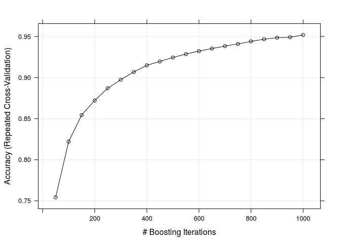
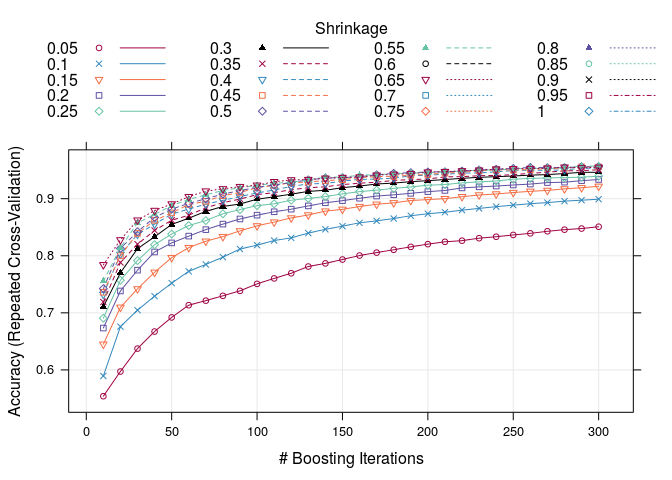
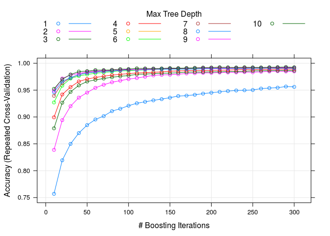
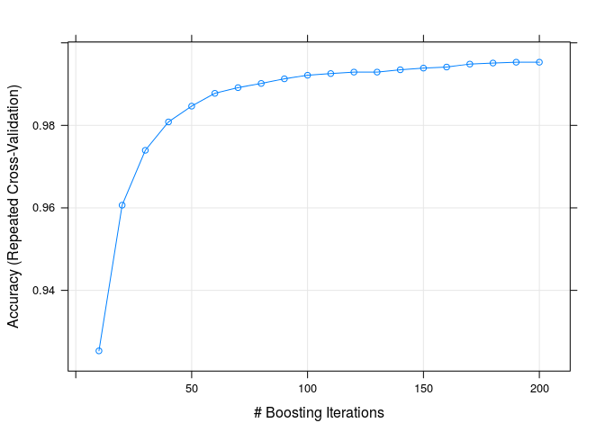

# Weight Lifting Exercise
Boris Shminke  
21.03.2015  

## Introduction

For introduction about the data and complete research see [this site](http://groupware.les.inf.puc-rio.br/har).
I used [this web-page](http://topepo.github.io/caret/training.html) for `caret` examples and GBM as a model because Owen Zhang [recommends](http://www.slideshare.net/freshdatabos/zhang-winning-datasciencecompetitions) it for simple modelling when you do not know what better to do instead.

## Data acqusition and partitioning

First, I defined libraries used, loaded data and set seed. For model tuning purposes I will use 2-fold cross-validation - an extremely fast method of assessing out of sample error. 2-fold cross validation is practically the same as using 50/50 training and testing subsets.


```r
options(warn=-1)
library(caret)
trellis.par.set(caretTheme())
training <- read.csv("pml-training.csv")
set.seed(17823)
fitControl <- trainControl(
  method = "repeatedcv",
  number = 2,
  repeats = 1,
  verbose = FALSE)
```

## Data cleansing and feature selection

I used `View` command in RStudio to preview overall data quality. After that I cleansed data a bit. Some variables have too many NAs (more than in a half of observations) and some are actually record IDs (name, timestamp, window flags). So I just dropped them and did not use for prediction.


```r
training <- training[ , c(8:11,37:49,60:68,84:86,102,113:124,140,151:160)]
```

Since we have only 53 predictors it is useless to use any compression technique like PCA.

## Tuning number of trees

First I tried 1000 trees, no interaction and 0.1 shrinkage.


```r
gbmGrid <- expand.grid(interaction.depth = 1,
  n.trees = (1:20)*50,
  shrinkage = 0.1)

gbmFit1 <- train(classe ~ ., data = training,
  method = "gbm",
  trControl = fitControl,
  tuneGrid = gbmGrid,
  verbose = FALSE)
```

```
## Loading required package: gbm
## Loading required package: survival
## 
## Attaching package: 'survival'
## 
## The following object is masked from 'package:caret':
## 
##     cluster
## 
## Loading required package: splines
## Loading required package: parallel
## Loaded gbm 2.1.1
## Loading required package: plyr
```

```r
plot(gbmFit1)
```

 

This means that 90% accuracy is achieved with only 300 boosting iterations and that next 700 make little impact.

## Shrinkage tuning

Now we will try to pick optimal shrinkage from `0.05, 0.1, ..., 0.95, 1` list for 300 trees and no interaction.


```r
gbmGrid <- expand.grid(shrinkage = c(1:20) * 0.05,
  n.trees = (1:30)*10,
  interaction.depth = 1)

gbmFit2 <- train(classe ~ ., data = training,
  method = "gbm",
  trControl = fitControl,
  tuneGrid = gbmGrid,
  verbose = FALSE)

plot(gbmFit2)
```

 

We can see that large shrinkage is better but setting shrinkages more than `0.5` really gains nothing.

## Interaction depth tuning

Of course, the more interaction depth, the better, but computations become more time consuming. So the next experiment is about picking the trade off for interaction depth from list `1:10`, 300 trees and 0.5 shrinkage.


```r
gbmGrid <- expand.grid(n.trees = (1:30)*10,
  shrinkage = 0.5,
  interaction.depth = c(1:10))

gbmFit3 <- train(classe ~ ., data = training,
  method = "gbm",
  trControl = fitControl,
  tuneGrid = gbmGrid,
  verbose = FALSE)
```

```
## Warning: predictions failed for Fold1.Rep1: shrinkage=0.5, interaction.depth= 5, n.trees=300 Error in lvl[x] : invalid subscript type 'list'
```

```
## Warning: predictions failed for Fold1.Rep1: shrinkage=0.5, interaction.depth=10, n.trees=300 Error in lvl[x] : invalid subscript type 'list'
```

```
## Warning: predictions failed for Fold2.Rep1: shrinkage=0.5, interaction.depth= 5, n.trees=300 Error in lvl[x] : invalid subscript type 'list'
```

```
## Warning: predictions failed for Fold2.Rep1: shrinkage=0.5, interaction.depth= 8, n.trees=300 Error in lvl[x] : invalid subscript type 'list'
```

```
## Warning in nominalTrainWorkflow(x = x, y = y, wts = weights, info =
## trainInfo, : There were missing values in resampled performance measures.
```

```
## Warning in train.default(x, y, weights = w, ...): missing values found in
## aggregated results
```

```r
plot(gbmFit3)
```

 

We can see that including interactions deeper than 5 is not very practical and also that number of trees can be decremented to 200 without substantial accuracy loss.

## Final estimations for out of sample error

To summarise, we have chosen a GBM model with 200 trees, 0.5 shrinkage and interactions of depth 5. Out accuracy estimate is about 99%.
For more precise estimation we will use standard 10-fold cross-validation technique.


```r
fitControl <- trainControl(
  method = "repeatedcv",
  number = 10,
  repeats = 1,
  verbose = FALSE)

gbmGrid <- expand.grid(n.trees = (1:20)*10,
  shrinkage = 0.5,
  interaction.depth = 5)

gbmFit4 <- train(classe ~ ., data = training,
  method = "gbm",
  trControl = fitControl,
  tuneGrid = gbmGrid,
  verbose = FALSE)

plot(gbmFit4)
```

 

Our model can be supposed to be highly accurate, about 99.5%

Another way of testing model is uploading a test set for evaluation. Let us generate required files.


```r
testing <- read.csv("pml-testing.csv")
answers <- predict(gbmFit4, testing)
 
pml_write_files = function(x){
  n = length(x)
  for(i in 1:n){
    filename = paste0("problem_id_",i,".txt")
    write.table(x[i],file=filename,quote=FALSE,row.names=FALSE,col.names=FALSE)
  }
}
 
pml_write_files(answers)
```

After manual submission to the course site we eventually faced 100% accuracy of prediction for our 20 test observations. This is another piece of evidence of the built model quality.

## Conclusion

We have built Gradient Boosting Model for 200 decision trees with interactions of depth 5 and shrinkage 0.5 using this variable list:


```r
names(training)
```

```
##  [1] "roll_belt"            "pitch_belt"           "yaw_belt"            
##  [4] "total_accel_belt"     "gyros_belt_x"         "gyros_belt_y"        
##  [7] "gyros_belt_z"         "accel_belt_x"         "accel_belt_y"        
## [10] "accel_belt_z"         "magnet_belt_x"        "magnet_belt_y"       
## [13] "magnet_belt_z"        "roll_arm"             "pitch_arm"           
## [16] "yaw_arm"              "total_accel_arm"      "gyros_arm_x"         
## [19] "gyros_arm_y"          "gyros_arm_z"          "accel_arm_x"         
## [22] "accel_arm_y"          "accel_arm_z"          "magnet_arm_x"        
## [25] "magnet_arm_y"         "magnet_arm_z"         "roll_dumbbell"       
## [28] "pitch_dumbbell"       "yaw_dumbbell"         "total_accel_dumbbell"
## [31] "gyros_dumbbell_x"     "gyros_dumbbell_y"     "gyros_dumbbell_z"    
## [34] "accel_dumbbell_x"     "accel_dumbbell_y"     "accel_dumbbell_z"    
## [37] "magnet_dumbbell_x"    "magnet_dumbbell_y"    "magnet_dumbbell_z"   
## [40] "roll_forearm"         "pitch_forearm"        "yaw_forearm"         
## [43] "total_accel_forearm"  "gyros_forearm_x"      "gyros_forearm_y"     
## [46] "gyros_forearm_z"      "accel_forearm_x"      "accel_forearm_y"     
## [49] "accel_forearm_z"      "magnet_forearm_x"     "magnet_forearm_y"    
## [52] "magnet_forearm_z"     "classe"
```

The model has high predicting power (ca. 99.5% accuracy) according to, first, 10-fold cross-validation performed on the training set and, second, scoring of independent test set from 20 observations.
